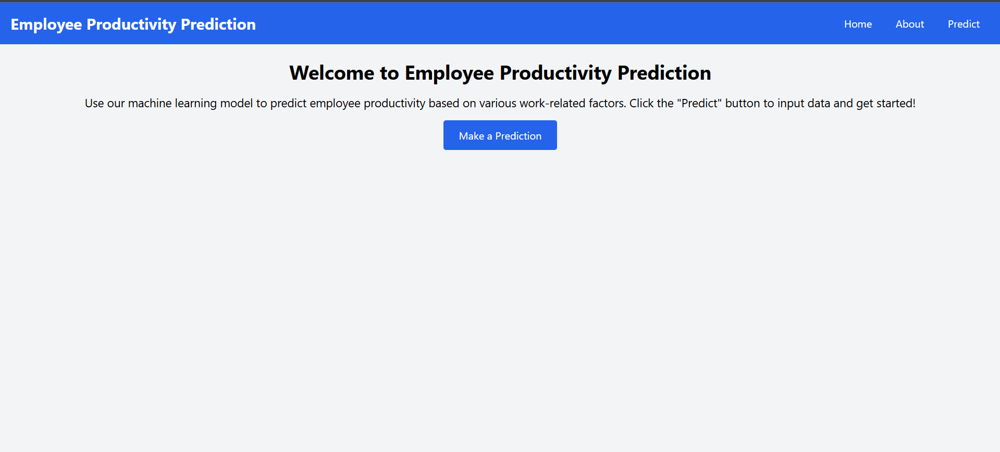
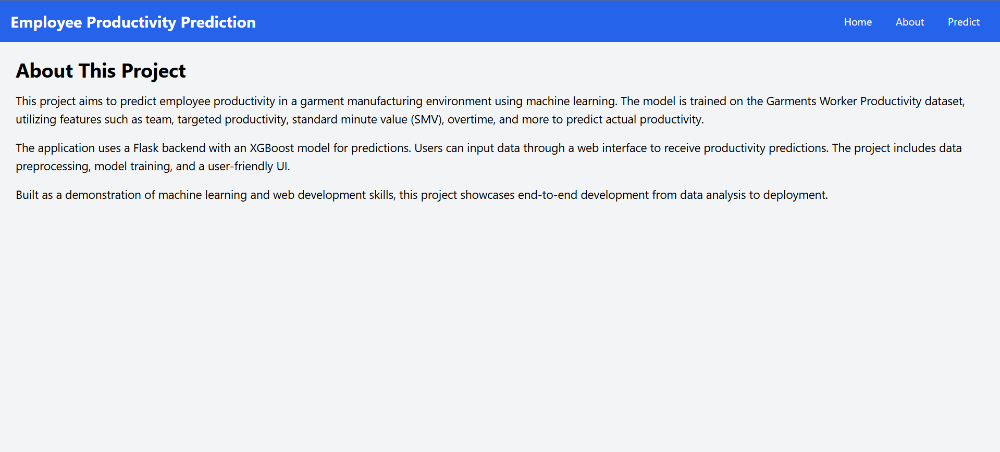
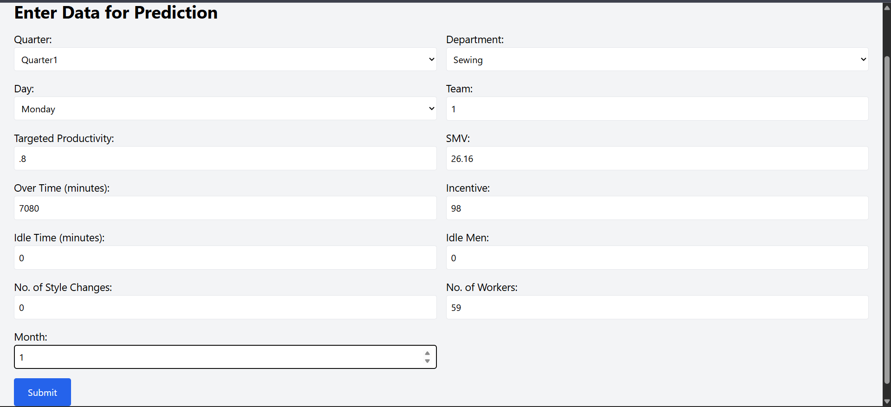
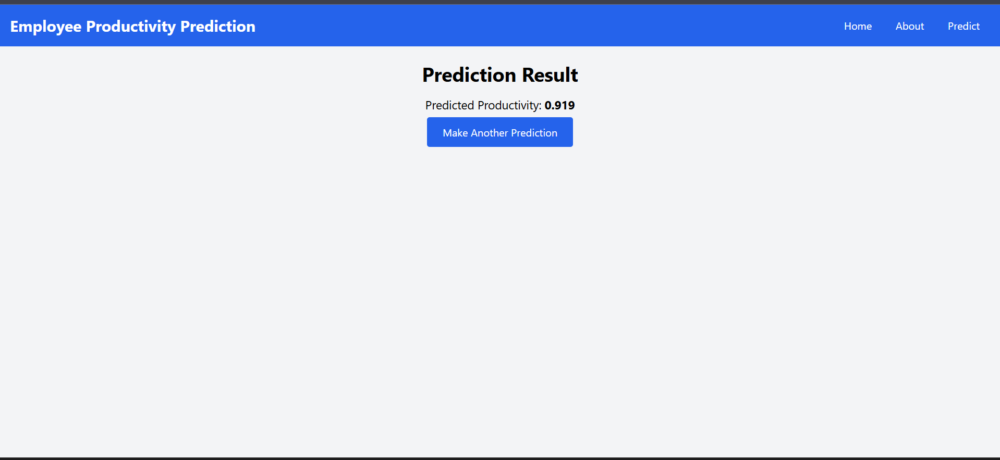

###Employee Productivity Prediction
**Project Overview**
This project develops a machine learning model to predict employee productivity in a garment manufacturing environment using the Garments Worker Productivity dataset. It preprocesses data, trains regression models (Linear Regression, Random Forest, XGBoost), and deploys predictions through a Flask web application with a user-friendly interface styled using Tailwind CSS. The Random Forest model, with the best performance (R2: 0.5544), is used for predictions.
This project demonstrates skills in data science, machine learning, and web development, making it ideal for a technical portfolio or resume.
Dataset Description
The dataset (garments_worker_productivity.csv) contains 1197 records with 15 features related to garment manufacturing teams:

Categorical Features: quarter (Quarter1–Quarter5), department (Sewing, Finishing), day (Monday–Sunday)
Numerical Features: team (1–12), targeted_productivity (0–1), smv (Standard Minute Value), over_time (minutes), incentive, idle_time, idle_men, no_of_style_change, no_of_workers, month (derived from date)
Target: actual_productivity (continuous, 0–1)
Dropped Features: wip (due to missing values), date (converted to month)

Project Structure
Employee_Productivity_Prediction/
├── app.py                  # Flask server-side script
├── gwp.pkl                # Saved Random Forest model
├── label_encoder.pkl      # Saved MultiColumnLabelEncoder
├── utils.py               # Utility module for MultiColumnLabelEncoder
├── Training/
│   └── Employee_Prediction.py  # Data preprocessing and model training
│   └── Employee_Prediction.ipynb  # Data preprocessing and model training and EDA part
├── templates/
│   ├── about.html         # About page
│   ├── home.html          # Home page
│   ├── predict.html       # Input form for predictions
│   └── submit.html        # Prediction result page
├── IBM/
│   └── (placeholder for IBM deployment files)

Methodology
1. Descriptive Analysis

Used pandas.info(), .shape, and .describe() to summarize data.
Insights: 1197 rows, 15 columns, wip had significant missing values, actual_productivity mean ~0.73.

2. Correlation Analysis

Computed correlation matrix for numerical features using pandas.corr().
Visualized with a Seaborn heatmap to identify feature relationships (e.g., no_of_workers vs. smv).

3. Data Preprocessing

Null Values: Dropped wip due to high missing values.
Date Handling: Converted date to datetime, extracted month, dropped date.
Department Cleaning: Merged duplicate finishing entries in department.
Categorical Encoding: Encoded quarter, department, day using a custom MultiColumnLabelEncoder (saved as label_encoder.pkl).
Data Splitting: Split data into 80% training and 20% testing sets (train_test_split, random_state=42).

4. Model Building

Trained three regression models:
Linear Regression: Baseline model.
Random Forest: Ensemble model (random_state=42).
XGBoost: Gradient boosting model (random_state=42).

Evaluated using Mean Absolute Error (MAE), Mean Squared Error (MSE), and R2 score.

5. Model Performance
Test set results:

Linear Regression:
MAE: 0.1075
MSE: 0.0214
R2 Score: 0.1932

Random Forest (Best Model):
MAE: 0.0670
MSE: 0.0118
R2 Score: 0.5544

XGBoost:
MAE: 0.0740
MSE: 0.0146
R2 Score: 0.4490

Action: Saved Random Forest model to gwp.pkl based on highest R2 score.

6. Flask Web Application

Backend: app.py loads gwp.pkl and label_encoder.pkl, defines routes for home, about, predict, and submit pages.
Frontend: HTML templates (home.html, about.html, predict.html, submit.html) styled with Tailwind CSS (via CDN).
Functionality:
Home: Welcomes users with a “Predict” button.
About: Describes the project and methodology.
Predict: Form to input 13 features (e.g., Quarter, Department, Team).
Submit: Displays predicted productivity using the Random Forest model.

Setup Instructions

Prerequisites:

Install Python 3.8+.
Install dependencies:pip install flask pandas numpy scikit-learn xgboost matplotlib seaborn

Prepare Files:

Place garments_worker_productivity.csv in the root folder (Employee_Productivity_Prediction/).
Ensure all files are in the project structure above.

Train Model:

Run Employee_Prediction.py to generate gwp.pkl (Random Forest model) and label_encoder.pkl:cd D:\Internship_projects\Employee_Productivity_Prediction\Training
python Employee_Prediction.py

Run Flask App:

Start the web server:cd D:\Internship_projects\Employee_Productivity_Prediction
python app.py

Access http://127.0.0.1:5000 in a browser.

Test Predictions:

Navigate to “Predict” page, enter inputs (e.g., Quarter=Quarter1, Department=Sewing, Team=1, Targeted Productivity=0.8, SMV=26.16, Over Time=7080, Incentive=98, Idle Time=0, Idle Men=0, No. of Style Changes=0, No. of Workers=59, Month=1).
Submit to view predicted productivity on submit.html.

Screenshots
Placeholder for images to be added by the user.

Home Page: Screenshot of home.html displaying the welcome message and “Predict” button.
About Page: Screenshot of about.html outlining the project details.
Predict Page: Screenshot of predict.html with the input form filled.
Prediction Result: Screenshot of submit.html showing a sample prediction (e.g., Predicted Productivity: 0.7356).

Instructions: Add screenshots by creating a screenshots folder in the project root and updating this section with image paths, e.g.:
- **Home Page**: 
- **About Page**: 
- **Predict Page**: 
- **Prediction Result**: 

Future Improvements

Deployment: Deploy to IBM Cloud, Heroku, or another platform using manifest.yml and requirements.txt.
Model Optimization: Tune Random Forest hyperparameters (e.g., n_estimators, max_depth).
UI Enhancements: Add visualizations (e.g., feature importance plots) to the web app.
Validation: Implement cross-validation or residual analysis for robust model evaluation.

Portfolio Note
This project highlights skills in:

Data Science: Data preprocessing, feature engineering, model training (Pandas, Scikit-learn, XGBoost).
Web Development: Flask backend, Tailwind CSS frontend.
End-to-End Development: From data analysis to a production-ready web application.

Resume Entry (STAR Method):

Situation: Needed to predict employee productivity in garment manufacturing.
Task: Develop a machine learning model and deploy it via a web app.
Action: Preprocessed data with Pandas, trained a Random Forest model (R2: 0.5544), and built a Flask app with Tailwind CSS.
Result: Delivered an accurate, user-friendly web application for productivity predictions.

